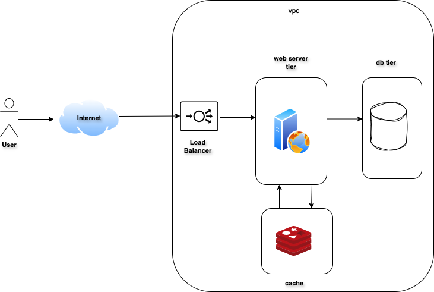

# Multi-Tier Web Application 
This repository contains Terraform configurations for setting up a highly available, multi-tier web application on DigitalOcean. It follows the multi-tier architecture model, where different layers or "tiers" are responsible for specific functionalities within the application, and each tier can scale independently. The setup includes a load balancer, web server, a private network for secure communication, and database and cache tiers.

# Architecture Diagram



### Data Flow Description

1. **Internet to Load Balancer**:
   - Users access the web application through the internet. The requests first hit the load balancer.

2. **Load Balancer to VPC Network**:
   - The load balancer distributes incoming HTTP requests to the web server(s) within the VPC (Virtual Private Cloud) network.

3. **VPC Network to Web Server**:
   - The nginx web server receives the requests from the load balancer then handles the application logic and serves the web pages.

4. **Web Servers to Database**:
   - For data storage and retrieval, the web servers communicate with the database (e.g., PostgreSQL). The database handles persistent data storage.

5. **Web Servers to Cache**:
   - To improve performance, the web server may also communicate with a cache (e.g., Redis) to store and retrieve frequently accessed data quickly.

6. **Database and Cache**:
   - The database and cache work together to ensure efficient data storage and retrieval. The cache reduces the load on the database by storing frequently accessed data in memory.

## Explanation of Multi-Tier Elements in This Setup

**Network Layer (VPC):**
- The Virtual Private Cloud (VPC) isolates resources within a secure, private network, enhancing security by preventing public access to internal components like the database and cache.

**Application Layer (Web Servers and Load Balancer):**
- This layer includes the web server instance and load balancer, which manage traffic distribution. The web servers handle the requests from users, while the load balancer ensures that the requests are evenly distributed among servers. This layer handles the core application logic.

**Data Layer (Database and Cache):**
- The data layer consists of a managed database instance and cache instance. The database is for persistent storage, handling data operations, while the cache improves the performance by storing frequently accessed data temporarily, reducing database load.

## How Multi-Tier Design Enhances This Setup

**Security:**
- Each layer is isolated, limiting access to critical resources like the database only to other internal tiers.

**Scalability:**
- Each tier can scale separately based on demand. For instance, you can increase web servers independently without affecting the database.

**Maintenance:**
- Each layer is maintained, upgraded, or modified independently, minimizing downtime.

## Prerequisites

- [Terraform](https://www.terraform.io/downloads.html) installed on your local machine.
- A [DigitalOcean](https://www.digitalocean.com/) account.
- A DigitalOcean API token.

1. **Clone the repository**

2. **Initialize Terraform:**
    ```sh
    terraform init
    ```

3. **Create a `terraform.tfvars` file:**

    Create a `terraform.tfvars` file in the root of your project and add the necessary variables. Here is a list of the variables you need to include:

    - `digitalocean_token`: Your DigitalOcean API token.
    - `vpc_name`: The name of the VPC.
    - `region`: The region where the resources will be deployed (e.g., `fra1` for Frankfurt).
    - `web_count`: The number of web server instances.
    - `web_size`: The size of the web server instances.
    - `web_image`: The image to use for the web server instances.
    - `lb_name`: The name of the load balancer.
    - `db_name`: The name of the database.
    - `db_engine`: The database engine (e.g., `pg` for PostgreSQL).
    - `db_version`: The version of the database engine.
    - `db_size`: The size of the database instance.
    - `db_node_count`: The number of database nodes.
    - `cache_name`: The name of the cache.
    - `cache_size`: The size of the cache instance.
    - `cache_node_count`: The number of cache nodes.
    - `cache_version`: The version of the cache engine.
    - `alert_name`: The name of the alert.
    - `alert_type`: The type of the alert (e.g., `droplet`).
    - `alert_description`: The description of the alert.
    - `compare`: The comparison operator for the alert.
    - `value`: The threshold value for the alert.
    - `window`: The time window for the alert.
    - `tags`: The tags to apply to resources.
    - `alert_email`: The email address to receive alerts.

4. **Validate the configuration:**

    ```sh
    terraform validate
    ```

5. **Apply the configuration:**

    ```sh
    terraform apply
    ```

    You will be prompted to confirm the action. Type `yes` to proceed.

## Configurations:

The Terraform configuration sets up the following components on DigitalOcean:

- **VPC**: A Virtual Private Cloud to isolate your resources.
- **Web Servers**: Multiple web server instances based on the specified count, size, and image.
- **Load Balancer**: A load balancer to distribute traffic across the web servers.
- **Database**: A managed database instance with the specified engine, version, and size.
- **Cache**: A managed cache instance with the specified size and node count.
- **Alerts**: Alerts configured to monitor high CPU usage on droplets.

### The SetUp

This setup follows a multi-tier architecture:

- **Network Layer**: Managed by the VPC module, which isolates and secures the resources.
- **Application Layer**: Managed by the Web and Load Balancer modules, which handle the web servers and traffic distribution.
- **Data Layer**: Managed by the Database and Cache modules, which handle data storage and caching.

## Verify the Deployment

After deploying the infrastructure, follow these steps to verify that everything is working correctly:

1. **SSH into the Web Server:**
    - Use the following command to SSH into one of the web servers:
      ```sh
      ssh root@<web_server_ip>
      ```

2. **Check if Nginx is Running:**
    - Verify that Nginx is installed and running:
      ```sh
      sudo systemctl status nginx
      ```

3. **Curl into the Local Server:**
    - Use `curl` to make a request to the local server and see if it responds correctly:
      ```sh
      curl http://localhost
      ```

### Example Commands

1. **SSH into the Web Server:**
    ```sh
    ssh root@123.201.241.49
    ```

2. **Check if Nginx is Running:**
    ```sh
    sudo systemctl status nginx
    ```

3. **Curl into the Local Server:**
    ```sh
    curl http://localhost
    ```

## Cleaning Up

To destroy the infrastructure created by Terraform, run:

```sh
terraform destroy
```

## License

This project is licensed under the MIT License. See the [LICENSE](LICENSE) file for details.

MIT License

Permission is hereby granted, free of charge, to any person obtaining a copy
of this software and associated documentation files (the "Software"), to deal
in the Software without restriction, including without limitation the rights
to use, copy, modify, merge, publish, distribute, sublicense, and/or sell
copies of the Software, and to permit persons to whom the Software is
furnished to do so, subject to the following conditions:

The above copyright notice and this permission notice shall be included in all
copies or substantial portions of the Software.

THE SOFTWARE IS PROVIDED "AS IS", WITHOUT WARRANTY OF ANY KIND, EXPRESS OR
IMPLIED, INCLUDING BUT NOT LIMITED TO THE WARRANTIES OF MERCHANTABILITY,
FITNESS FOR A PARTICULAR PURPOSE AND NONINFRINGEMENT. IN NO EVENT SHALL THE
AUTHORS OR COPYRIGHT HOLDERS BE LIABLE FOR ANY CLAIM, DAMAGES OR OTHER
LIABILITY, WHETHER IN AN ACTION OF CONTRACT, TORT OR OTHERWISE, ARISING FROM,
OUT OF OR IN CONNECTION WITH THE SOFTWARE OR THE USE OR OTHER DEALINGS IN THE
SOFTWARE.
